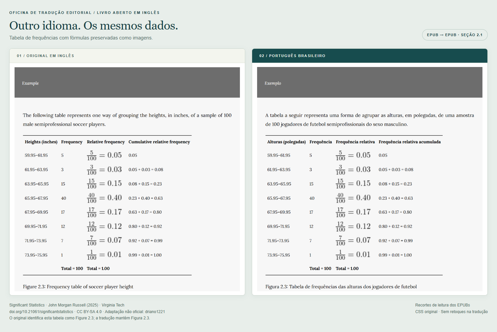
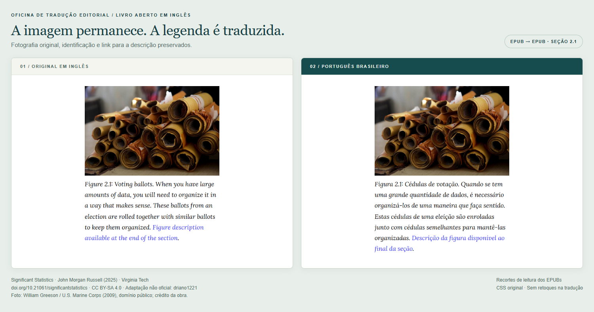
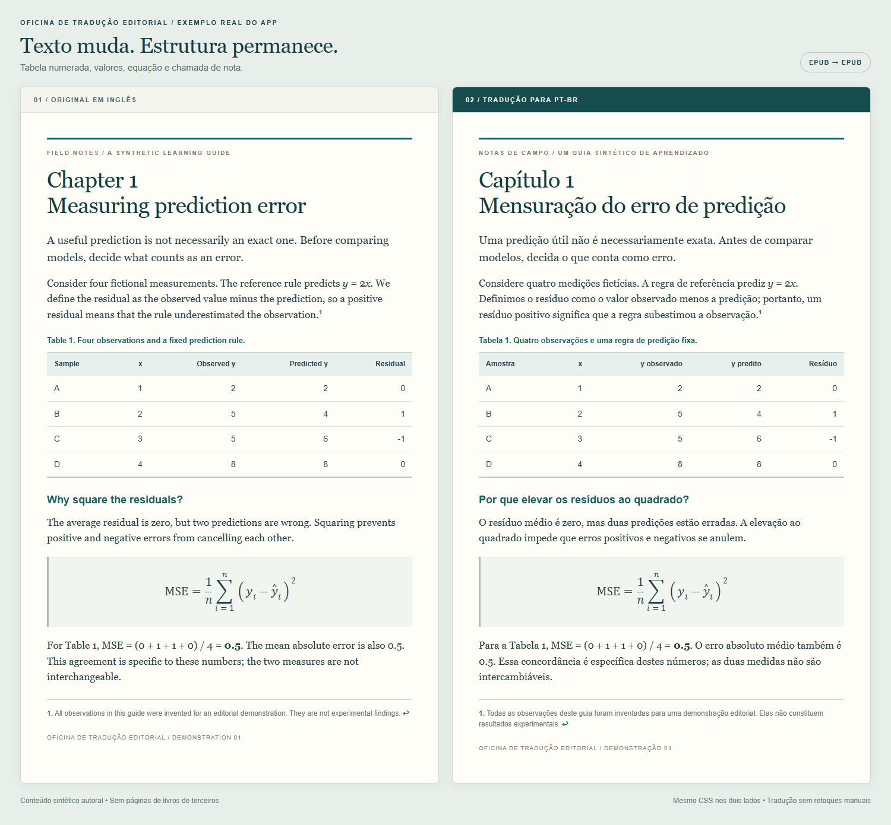
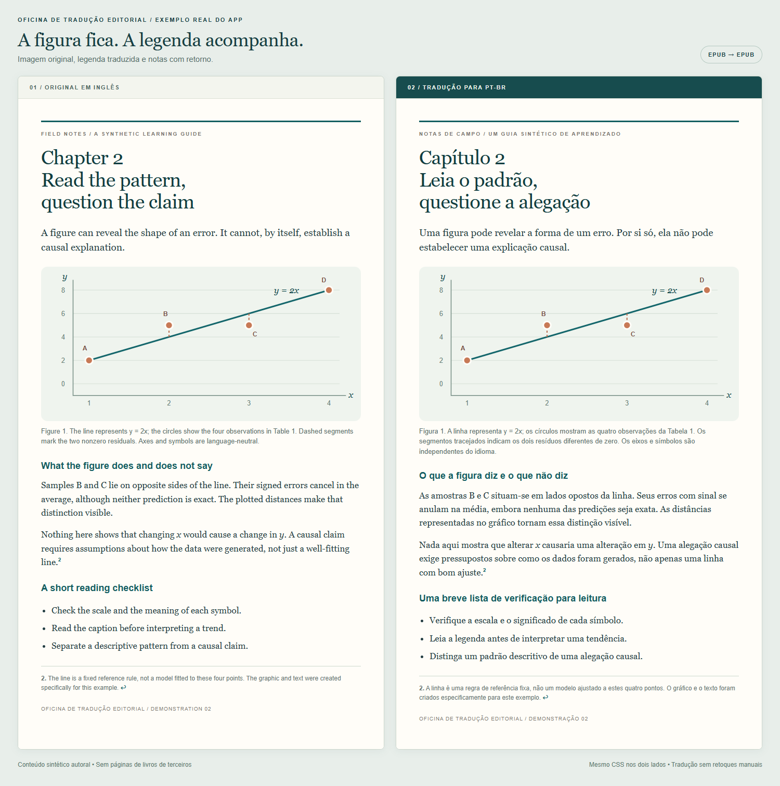
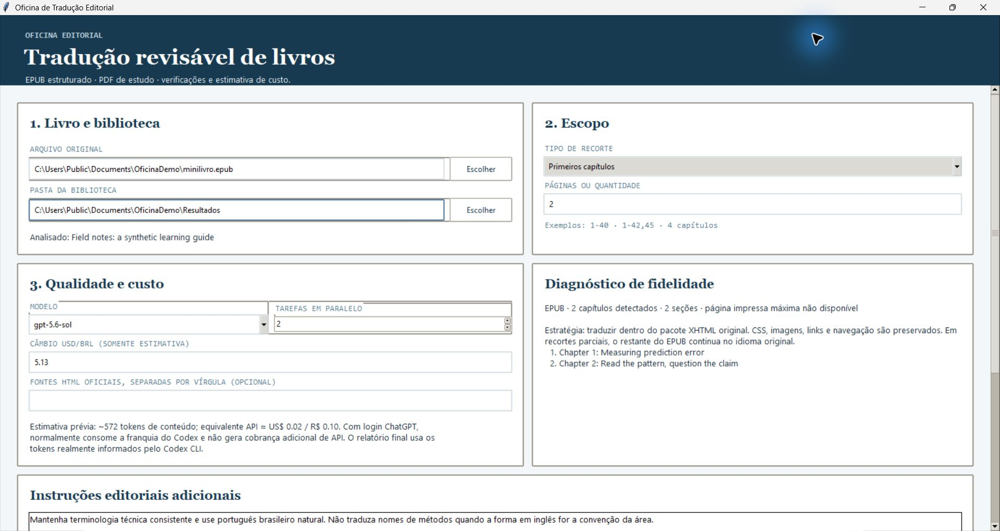

# Oficina de Tradução Editorial

Livro entra. Tradução revisável sai.

Aplicativo local para Windows que traduz PDF e EPUB para português brasileiro, organiza original, entrega e relatórios e registra uma estimativa de custo a partir do uso informado pelo Codex CLI.

Nasceu de uma necessidade de estudo: traduzir sem transformar notas em parágrafos soltos, perder legendas ou desmontar o livro inteiro para trocar o idioma.

> O caminho mais fiel hoje é EPUB → EPUB: substituir texto dentro do pacote original. PDF → PDF ainda é um modo de estudo, não uma réplica da diagramação.

[](https://github.com/driano1221/oficina-traducao-editorial/actions/workflows/tests.yml)

## Veja uma tradução real

Um livro aberto em inglês, traduzido para pt-BR: **Significant Statistics**, de John Morgan Russell (Virginia Tech, 2025). A seção 2.1 passou pelo motor do app; abaixo, um recorte do original e da tradução, com o CSS da obra preservado.



**119 elementos traduzidos, duas tabelas e 13 ocorrências de imagens, incluindo 12 fórmulas.** Valores, arquivos de imagem, identificadores e links internos foram conferidos. Os comparativos mostram o **EPUB**, não uma réplica do PDF; o texto em português pode mudar quebras e larguras automáticas.

<details>
<summary>Veja a fotografia e sua legenda traduzida</summary>



</details>

Obra e comparativos sob **[CC BY-SA 4.0](https://creativecommons.org/licenses/by-sa/4.0/)**; fotografia identificada como domínio público na fonte. Tradução e montagem não oficiais, sem endosso da universidade. [Fonte, créditos completos, reprodução e limites](examples/significant-statistics/README.md).

Equivalente API registrado: **US$ 0,7922**, incluindo tentativas recusadas, retomada e auditoria. Não é fatura nem custo de desenvolvimento. [Evidência da execução](examples/significant-statistics/validacao.json).

## Exemplo sintético para testar o pipeline

Um minilivro autoral de dois capítulos, com dados fictícios, passou pelo motor do aplicativo. À esquerda, o original; à direita, a tradução para pt-BR. O conteúdo abaixo foi extraído dos dois EPUBs e renderizado no mesmo navegador, com **o mesmo CSS**, sem retoques manuais na tradução.



**48 elementos traduzidos.** A tabela mantém seus valores; a equação, seus símbolos; a figura, seus bytes; as notas, seus links de ida e volta. Há diferenças naturais de quebra de linha. Isso demonstra este EPUB, não fidelidade universal em PDF.

<details>
<summary>Veja também a figura, a legenda e as notas</summary>



O gráfico usa eixos e símbolos independentes do idioma. O exemplo não demonstra tradução de texto dentro de imagens.

</details>

<details>
<summary>Interface do aplicativo com o minilivro selecionado</summary>



A tela mostra a configuração anterior à execução, não o custo final. A estimativa inicial subestimou o uso deste exemplo; os números medidos estão abaixo.

</details>

[Original em inglês](examples/minilivro/publicados/original.epub) · [Tradução em pt-BR](examples/minilivro/publicados/traduzido.epub) · [Como reproduzir e o que foi verificado](examples/minilivro/README.md)

Equivalente API registrado: **US$ 0,0875 na execução final**; **US$ 0,1791 incluindo a primeira execução e a revisão de terminologia**. Não é fatura. A [evidência publicada](examples/minilivro/publicados/validacao.json) não contém caminhos pessoais nem dados de autenticação.

## Comece aqui

| Quero… | Onde |
| --- | --- |
| Instalar e traduzir | [Como usar](docs/COMO_USAR.md) |
| Entender o que é preservado | [Arquitetura e limites](docs/ARQUITETURA.md) |
| Conferir os testes | [Auditoria](docs/AUDITORIA.md) |
| Gerar o executável Windows | [Build e distribuição](docs/BUILD_E_DISTRIBUICAO.md) |
| Entender a origem do projeto | [Origem e próximos passos](docs/ORIGEM_E_LIMITES.md) |
| Contribuir | [CONTRIBUTING](CONTRIBUTING.md) |

## O que ele faz

- Interface em português para escolher arquivo, páginas ou primeiros capítulos.
- EPUB estruturado: troca o conteúdo dos elementos traduzidos e mantém os demais arquivos do pacote.
- Preserva imagens e protege fórmulas no fluxo EPUB. Texto dentro de imagens permanece no idioma original.
- Mantém links, identificadores e atributos dos elementos traduzidos; rejeita respostas que alterem essa estrutura.
- Usa glossário editável e cache por conteúdo, modelo e instruções.
- Separa livros e configurações diferentes em projetos distintos.
- Gera relatórios de estrutura, validação local e auditoria bilíngue seletiva nos modos editoriais.
- Mostra estimativa antes da execução e equivalente API ao final, quando há dados de uso.

## Escolha o caminho

| Entrada | Entrega | Fidelidade nesta beta |
| --- | --- | --- |
| EPUB com capítulos reconhecidos ou marcadores de página | EPUB + PDF + HTML + texto | EPUB mantém imagens, CSS, navegação e conteúdo fora do recorte; PDF/HTML são refluídos |
| PDF com texto extraível | PDF + HTML + Markdown | Imagem da página original para conferência e texto traduzido; sem reconstrução geométrica |
| HTML oficial com `<article>`, informado manualmente | PDF + HTML + texto | Experimental: traduz os artigos inteiros; o intervalo do PDF não recorta essas URLs |

EPUB não tem paginação fixa. O recorte por página só funciona com marcadores `pg_N` compatíveis. Capítulos são reconhecidos por títulos como `1. Introduction`, `Chapter 1`, `Capítulo 1` e `第1章`, em documentos separados. Seções decimais como `2.1 Background` não são confundidas com capítulos. Nem todo EPUB usa um desses formatos.

## Rodar

Requisitos: Windows 10/11, Python 3.11 com Tkinter, Codex CLI instalado e autenticado, acesso a um modelo compatível. Chrome ou Edge é necessário para o PDF editorial. A tradução exige internet.

No PowerShell, dentro da pasta do projeto:

```powershell
.\setup.ps1
.\iniciar.ps1
```

Para o executável local:

```powershell
.\build_exe.ps1
```

Saída: `dist/OficinaTraducao.exe`. O executável empacota Python e a interface; **não inclui o Codex CLI, login, modelo nem navegador**.

A primeira publicação contém código-fonte e instruções de build. Não há binário público pronto para download nesta beta.

## Saídas organizadas

```text
resultados/
└── nome_do_livro_identificador/
    ├── LEIA-ME.md
    ├── projeto.json
    ├── 01_original/        # cópia do arquivo recebido
    ├── 02_trabalho/        # extração, blocos, cache e uso
    ├── 03_entrega_atual/   # arquivos para leitura e seus ativos
    └── 04_relatorios/      # QA, manifesto e custo
```

Repetir a mesma configuração permite retomar blocos válidos. Mudar o recorte, modelo ou instruções cria outro projeto na interface. Pela CLI, use uma pasta nova ao alterar a configuração.

## Custo não é fatura

A estimativa usa uma tabela local de preços de referência e o câmbio informado. O relatório final soma as chamadas registradas por modelo, incluindo tentativas e auditoria.

**Equivalente API ≠ valor cobrado na sua conta.** O app não consulta faturas, saldo ou limites do plano. Falta de telemetria aparece como indisponível, não como tradução grátis. Veja [custos e privacidade](docs/COMO_USAR.md#custos-e-privacidade).

## Mapa

```text
app.py                interface e organização da biblioteca
tradutor.py           extração, tradução, exportação, QA e custo
glossario.json        terminologia padrão, editável
benchmarks/           trava de regressão por hashes, sem publicar livros privados
tests/                testes com conteúdo sintético
docs/                 uso, decisões, limites e validação
.github/workflows/    testes no Windows
```

## Estado

Beta de estudo. Há 27 testes automatizados com dados sintéticos, sem chamadas pagas na suíte, além das execuções reais do minilivro e da seção do livro aberto documentadas acima. A auditoria semântica agora recebe apenas trechos selecionados por risco; números, fórmulas, estrutura e expressões inequívocas do glossário são verificados localmente. Isso verifica contratos do pipeline e essas amostras; não prova qualidade de tradução em qualquer livro.

Não faz OCR, não remove DRM, não traduz diagramas rasterizados automaticamente e não promete fidelidade visual absoluta. Uma revisão humana continua necessária. Não use documentos não confiáveis ou sensíveis sem avaliar os riscos.

## Origem e licença

Inspirado no fluxo do [translate-book](https://github.com/deusyu/translate-book), de Rainman, distribuído sob MIT. O foco aqui é uma aplicação Windows com preservação estrutural de EPUB, organização das entregas e rastreabilidade.

Não é um novo modelo de tradução, nem uma reivindicação de ter inventado tradução de livros com LLMs. É um projeto de aplicação e integração, desenvolvido com assistência de IA e orientado por problemas reais de uso.

Código deste projeto sob [AGPL-3.0](LICENSE), considerando o uso de PyMuPDF. Créditos e dependências em [NOTICE](NOTICE.md). Sem vínculo oficial com OpenAI ou com os projetos citados.

O repositório inclui um minilivro sintético autoral e comparativos de um trecho de obra aberta, com licença e atribuição explícitas. Não distribui livros privados, credenciais ou arquivos pessoais. Use apenas materiais para os quais você tenha os direitos ou permissões necessários.
